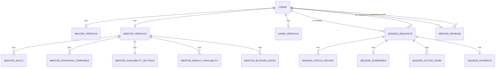

# PathFinder Database Schema

This schema is based on the current Spring Boot + Thymeleaf codebase and the implemented data flow in:
- `/auth/*`
- `/seeker/*`
- `/mentor/*`
- `/admin/*`
- `/seeker/sessions/*` and `/mentor/requests/*`

It is designed for H2 now and JPA-friendly migration to MySQL later.

## 1. Relationship Overview



## 2. Core H2 DDL

```sql
CREATE TABLE users (
    id BIGINT GENERATED BY DEFAULT AS IDENTITY PRIMARY KEY,
    email VARCHAR(255) NOT NULL UNIQUE,
    password_hash VARCHAR(255) NOT NULL,
    role VARCHAR(16) NOT NULL CHECK (role IN ('MENTEE', 'MENTOR', 'ADMIN')),
    account_status VARCHAR(24) NOT NULL DEFAULT 'ACTIVE'
        CHECK (account_status IN ('ACTIVE', 'SUSPENDED', 'PENDING_VERIFICATION')),
    first_name VARCHAR(100),
    last_name VARCHAR(100),
    created_at TIMESTAMP NOT NULL DEFAULT CURRENT_TIMESTAMP,
    updated_at TIMESTAMP NOT NULL DEFAULT CURRENT_TIMESTAMP
);

CREATE TABLE mentee_profiles (
    user_id BIGINT PRIMARY KEY,
    target_role VARCHAR(160) NOT NULL,
    experience_level VARCHAR(40),
    timezone VARCHAR(64),
    goals CLOB,
    created_at TIMESTAMP NOT NULL DEFAULT CURRENT_TIMESTAMP,
    updated_at TIMESTAMP NOT NULL DEFAULT CURRENT_TIMESTAMP,
    CONSTRAINT fk_mentee_profile_user FOREIGN KEY (user_id) REFERENCES users(id)
);

CREATE TABLE mentor_profiles (
    user_id BIGINT PRIMARY KEY,
    expertise CLOB NOT NULL,
    hourly_rate_cents INT NOT NULL CHECK (hourly_rate_cents >= 0),
    current_title VARCHAR(120),
    current_company VARCHAR(120),
    tagline VARCHAR(200),
    industry VARCHAR(80),
    bio CLOB,
    timezone VARCHAR(64),
    sessions_completed INT NOT NULL DEFAULT 0,
    is_verified BOOLEAN NOT NULL DEFAULT FALSE,
    created_at TIMESTAMP NOT NULL DEFAULT CURRENT_TIMESTAMP,
    updated_at TIMESTAMP NOT NULL DEFAULT CURRENT_TIMESTAMP,
    CONSTRAINT fk_mentor_profile_user FOREIGN KEY (user_id) REFERENCES users(id)
);

CREATE TABLE admin_profiles (
    user_id BIGINT PRIMARY KEY,
    team VARCHAR(120) NOT NULL,
    timezone VARCHAR(64),
    escalation_channel VARCHAR(120),
    on_call_window VARCHAR(120),
    notes CLOB,
    created_at TIMESTAMP NOT NULL DEFAULT CURRENT_TIMESTAMP,
    updated_at TIMESTAMP NOT NULL DEFAULT CURRENT_TIMESTAMP,
    CONSTRAINT fk_admin_profile_user FOREIGN KEY (user_id) REFERENCES users(id)
);

CREATE TABLE mentor_skills (
    mentor_user_id BIGINT NOT NULL,
    skill_name VARCHAR(100) NOT NULL,
    PRIMARY KEY (mentor_user_id, skill_name),
    CONSTRAINT fk_mentor_skill_profile FOREIGN KEY (mentor_user_id) REFERENCES mentor_profiles(user_id)
);

CREATE TABLE mentor_interview_companies (
    mentor_user_id BIGINT NOT NULL,
    company_name VARCHAR(120) NOT NULL,
    PRIMARY KEY (mentor_user_id, company_name),
    CONSTRAINT fk_mentor_interview_company_profile FOREIGN KEY (mentor_user_id) REFERENCES mentor_profiles(user_id)
);

CREATE TABLE mentor_availability_settings (
    mentor_user_id BIGINT PRIMARY KEY,
    timezone VARCHAR(64) NOT NULL,
    slot_length_minutes INT NOT NULL CHECK (slot_length_minutes IN (30, 45, 60)),
    buffer_minutes INT NOT NULL CHECK (buffer_minutes IN (0, 10, 15)),
    min_booking_notice_hours INT NOT NULL CHECK (min_booking_notice_hours IN (6, 12, 24, 48)),
    updated_at TIMESTAMP NOT NULL DEFAULT CURRENT_TIMESTAMP,
    CONSTRAINT fk_mentor_availability_settings_profile FOREIGN KEY (mentor_user_id) REFERENCES mentor_profiles(user_id)
);

CREATE TABLE mentor_weekly_availability (
    id BIGINT GENERATED BY DEFAULT AS IDENTITY PRIMARY KEY,
    mentor_user_id BIGINT NOT NULL,
    weekday TINYINT NOT NULL CHECK (weekday BETWEEN 1 AND 7),
    start_time TIME NOT NULL,
    end_time TIME NOT NULL,
    is_enabled BOOLEAN NOT NULL DEFAULT TRUE,
    CHECK (start_time < end_time),
    CONSTRAINT uq_mentor_weekday UNIQUE (mentor_user_id, weekday),
    CONSTRAINT fk_mentor_weekly_availability_profile FOREIGN KEY (mentor_user_id) REFERENCES mentor_profiles(user_id)
);

CREATE TABLE mentor_blocked_dates (
    id BIGINT GENERATED BY DEFAULT AS IDENTITY PRIMARY KEY,
    mentor_user_id BIGINT NOT NULL,
    blocked_date DATE NOT NULL,
    reason VARCHAR(255),
    CONSTRAINT uq_mentor_blocked_date UNIQUE (mentor_user_id, blocked_date),
    CONSTRAINT fk_mentor_blocked_dates_profile FOREIGN KEY (mentor_user_id) REFERENCES mentor_profiles(user_id)
);

CREATE TABLE session_requests (
    id BIGINT GENERATED BY DEFAULT AS IDENTITY PRIMARY KEY,
    request_code VARCHAR(32) NOT NULL UNIQUE,
    mentee_user_id BIGINT NOT NULL,
    mentor_user_id BIGINT NOT NULL,
    slot_start_at TIMESTAMP NOT NULL,
    slot_end_at TIMESTAMP NOT NULL,
    mentor_timezone VARCHAR(64) NOT NULL,
    session_type VARCHAR(40) NOT NULL,
    objective CLOB NOT NULL,
    booking_notes CLOB,
    mentor_note CLOB,
    meeting_url VARCHAR(400),
    status VARCHAR(16) NOT NULL
        CHECK (status IN ('REQUESTED', 'APPROVED', 'DECLINED', 'CANCELLED', 'COMPLETED')),
    submitted_at TIMESTAMP NOT NULL DEFAULT CURRENT_TIMESTAMP,
    decided_at TIMESTAMP,
    updated_at TIMESTAMP NOT NULL DEFAULT CURRENT_TIMESTAMP,
    CONSTRAINT fk_session_request_mentee FOREIGN KEY (mentee_user_id) REFERENCES users(id),
    CONSTRAINT fk_session_request_mentor FOREIGN KEY (mentor_user_id) REFERENCES users(id),
    CHECK (slot_start_at < slot_end_at)
);

CREATE TABLE session_status_history (
    id BIGINT GENERATED BY DEFAULT AS IDENTITY PRIMARY KEY,
    session_request_id BIGINT NOT NULL,
    from_status VARCHAR(16),
    to_status VARCHAR(16) NOT NULL,
    changed_by_user_id BIGINT NOT NULL,
    note VARCHAR(500),
    changed_at TIMESTAMP NOT NULL DEFAULT CURRENT_TIMESTAMP,
    CONSTRAINT fk_session_status_history_request FOREIGN KEY (session_request_id) REFERENCES session_requests(id),
    CONSTRAINT fk_session_status_history_actor FOREIGN KEY (changed_by_user_id) REFERENCES users(id)
);

CREATE TABLE session_summaries (
    session_request_id BIGINT PRIMARY KEY,
    summary_text CLOB NOT NULL,
    created_by_mentor_id BIGINT NOT NULL,
    created_at TIMESTAMP NOT NULL DEFAULT CURRENT_TIMESTAMP,
    updated_at TIMESTAMP NOT NULL DEFAULT CURRENT_TIMESTAMP,
    CONSTRAINT fk_session_summary_request FOREIGN KEY (session_request_id) REFERENCES session_requests(id),
    CONSTRAINT fk_session_summary_mentor FOREIGN KEY (created_by_mentor_id) REFERENCES users(id)
);

CREATE TABLE session_action_items (
    id BIGINT GENERATED BY DEFAULT AS IDENTITY PRIMARY KEY,
    session_request_id BIGINT NOT NULL,
    owner_user_id BIGINT NOT NULL,
    description VARCHAR(300) NOT NULL,
    due_date DATE,
    status VARCHAR(16) NOT NULL DEFAULT 'OPEN' CHECK (status IN ('OPEN', 'DONE')),
    completed_at TIMESTAMP,
    created_at TIMESTAMP NOT NULL DEFAULT CURRENT_TIMESTAMP,
    CONSTRAINT fk_session_action_item_request FOREIGN KEY (session_request_id) REFERENCES session_requests(id),
    CONSTRAINT fk_session_action_item_owner FOREIGN KEY (owner_user_id) REFERENCES users(id)
);

CREATE TABLE session_payments (
    id BIGINT GENERATED BY DEFAULT AS IDENTITY PRIMARY KEY,
    session_request_id BIGINT NOT NULL UNIQUE,
    amount_cents INT NOT NULL CHECK (amount_cents >= 0),
    currency CHAR(3) NOT NULL DEFAULT 'CAD',
    status VARCHAR(16) NOT NULL CHECK (status IN ('UNPAID', 'PAID', 'REFUNDED')),
    provider VARCHAR(40),
    provider_reference VARCHAR(120),
    paid_at TIMESTAMP,
    refunded_at TIMESTAMP,
    created_at TIMESTAMP NOT NULL DEFAULT CURRENT_TIMESTAMP,
    updated_at TIMESTAMP NOT NULL DEFAULT CURRENT_TIMESTAMP,
    CONSTRAINT fk_session_payment_request FOREIGN KEY (session_request_id) REFERENCES session_requests(id)
);

CREATE TABLE mentor_reviews (
    id BIGINT GENERATED BY DEFAULT AS IDENTITY PRIMARY KEY,
    mentor_user_id BIGINT NOT NULL,
    submitted_at TIMESTAMP NOT NULL DEFAULT CURRENT_TIMESTAMP,
    stage VARCHAR(80) NOT NULL,
    review_status VARCHAR(16) NOT NULL
        CHECK (review_status IN ('DUE_TODAY', 'ON_TRACK', 'BLOCKED', 'APPROVED', 'REJECTED')),
    interview_evidence_summary VARCHAR(255),
    profile_quality_summary VARCHAR(255),
    admin_note CLOB,
    next_step VARCHAR(255),
    reviewed_by_admin_id BIGINT,
    reviewed_at TIMESTAMP,
    is_open BOOLEAN NOT NULL DEFAULT TRUE,
    CONSTRAINT fk_mentor_review_mentor FOREIGN KEY (mentor_user_id) REFERENCES users(id),
    CONSTRAINT fk_mentor_review_admin FOREIGN KEY (reviewed_by_admin_id) REFERENCES users(id)
);
```

## 3. Recommended Indexes

```sql
CREATE INDEX idx_users_role_status ON users(role, account_status);
CREATE INDEX idx_mentor_profiles_industry ON mentor_profiles(industry);
CREATE INDEX idx_mentor_interview_company_name ON mentor_interview_companies(company_name);
CREATE INDEX idx_mentor_skills_name ON mentor_skills(skill_name);

CREATE INDEX idx_session_requests_mentor_status_time
    ON session_requests(mentor_user_id, status, slot_start_at);
CREATE INDEX idx_session_requests_mentee_status_time
    ON session_requests(mentee_user_id, status, slot_start_at);
CREATE INDEX idx_session_requests_status_submitted
    ON session_requests(status, submitted_at);

CREATE INDEX idx_mentor_reviews_status_submitted
    ON mentor_reviews(review_status, submitted_at);
CREATE INDEX idx_mentor_reviews_mentor_open
    ON mentor_reviews(mentor_user_id, is_open);

CREATE INDEX idx_action_items_owner_status_due
    ON session_action_items(owner_user_id, status, due_date);
```

## 4. How Current UI Flows Map to Tables

1. Auth (`/auth/login`, `/auth/signup`, `/auth/forgot`)
- `users` stores credentials, role, and account status.

2. Mentee profile (`/seeker/profile`)
- `users` + `mentee_profiles`.

3. Mentor profile + badges (`/mentor/profile`)
- `users` + `mentor_profiles` + `mentor_skills` + `mentor_interview_companies`.

4. Mentor availability (`/mentor/availability`)
- `mentor_availability_settings` + `mentor_weekly_availability` + `mentor_blocked_dates`.

5. Mentor discovery (`/seeker/mentors`, `/mentors/{mentorSlug}`)
- Query `mentor_profiles`, `mentor_skills`, `mentor_interview_companies`.
- Filter by `industry`, interview company, and search text.

6. Request session (`POST /seeker/sessions`)
- Create `session_requests` row with `status='REQUESTED'`.
- Add first `session_status_history` row.

7. Mentor decision (`POST /mentor/requests/{id}/decision`)
- Update `session_requests.status` to `APPROVED` or `DECLINED`.
- Save `mentor_note` and append `session_status_history`.

8. Mentee/Mentor calendar + upcoming cards
- Read from `session_requests` by role where status in active statuses and slot date range.

9. Admin mentor review (`/admin/mentors/review`)
- Queue and detail card read from `mentor_reviews` + mentor profile tables.

10. Post-session outcomes (README scope)
- `session_summaries`, `session_action_items`, `session_payments`.

## 5. Query Patterns (H2 SQL)

### Mentee mentor search with filters

```sql
SELECT mp.user_id, u.first_name, u.last_name, mp.current_title, mp.current_company,
       mp.industry, mp.hourly_rate_cents
FROM mentor_profiles mp
JOIN users u ON u.id = mp.user_id
WHERE u.account_status = 'ACTIVE'
  AND (:industry IS NULL OR mp.industry = :industry)
  AND (
      :interview_company IS NULL
      OR EXISTS (
          SELECT 1
          FROM mentor_interview_companies mic
          WHERE mic.mentor_user_id = mp.user_id
            AND mic.company_name = :interview_company
      )
  )
  AND (
      :q IS NULL
      OR LOWER(CONCAT(COALESCE(u.first_name, ''), ' ', COALESCE(u.last_name, ''))) LIKE LOWER(CONCAT('%', :q, '%'))
      OR LOWER(COALESCE(mp.current_title, '')) LIKE LOWER(CONCAT('%', :q, '%'))
      OR LOWER(COALESCE(mp.current_company, '')) LIKE LOWER(CONCAT('%', :q, '%'))
      OR EXISTS (
          SELECT 1 FROM mentor_skills ms
          WHERE ms.mentor_user_id = mp.user_id
            AND LOWER(ms.skill_name) LIKE LOWER(CONCAT('%', :q, '%'))
      )
  );
```

### Mentor request queue (pending first)

```sql
SELECT *
FROM session_requests
WHERE mentor_user_id = :mentor_user_id
ORDER BY CASE WHEN status = 'REQUESTED' THEN 0 ELSE 1 END,
         submitted_at DESC;
```

### Mentee session detail

```sql
SELECT sr.*,
       u_mentor.first_name AS mentor_first_name,
       u_mentor.last_name AS mentor_last_name
FROM session_requests sr
JOIN users u_mentor ON u_mentor.id = sr.mentor_user_id
WHERE sr.request_code = :request_code
  AND sr.mentee_user_id = :mentee_user_id;
```

### Mentor weekly calendar (approved/completed)

```sql
SELECT request_code, status, session_type, slot_start_at, slot_end_at
FROM session_requests
WHERE mentor_user_id = :mentor_user_id
  AND status IN ('APPROVED', 'COMPLETED')
  AND slot_start_at >= :week_start
  AND slot_start_at < :week_end
ORDER BY slot_start_at;
```

## 6. JPA Entity Set (directly implied)

- `User`
- `MenteeProfile`
- `MentorProfile`
- `MentorSkill`
- `MentorInterviewCompany`
- `MentorAvailabilitySettings`
- `MentorWeeklyAvailability`
- `MentorBlockedDate`
- `SessionRequest`
- `SessionStatusHistory`
- `SessionSummary`
- `SessionActionItem`
- `SessionPayment`
- `MentorReview`

## 7. Notes

1. Store timestamps in UTC in application code; timezone string stays in profile/settings.
2. Keep `request_code` as user-facing ID (`REQ-####`), but use numeric `id` as PK/FK.
3. Admin review is modeled as data rows (`mentor_reviews`) instead of hardcoded lists in controller.
4. This schema is intentionally normalized so mentor filters and queue pages stay efficient as data grows.
